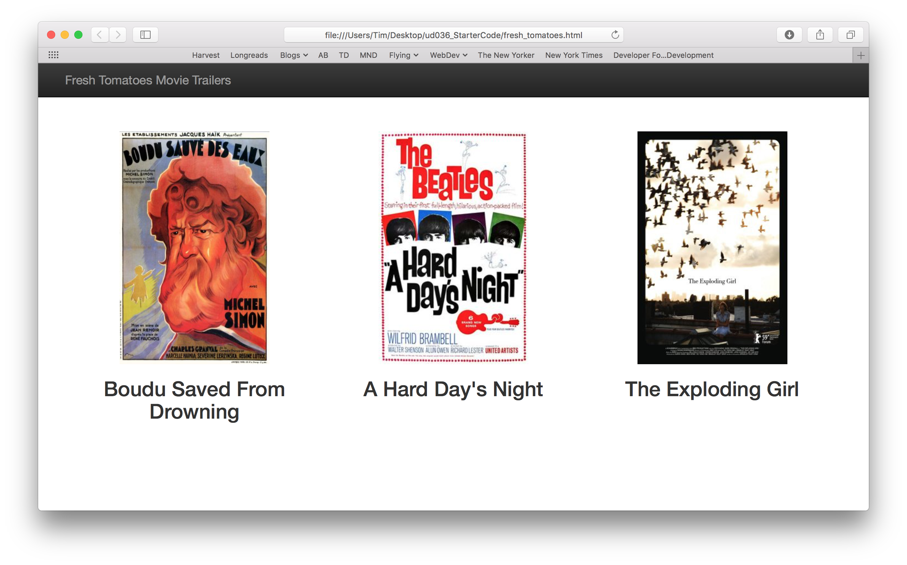
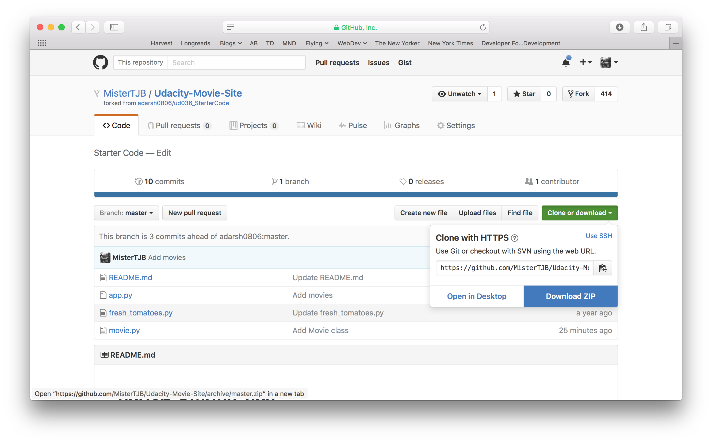
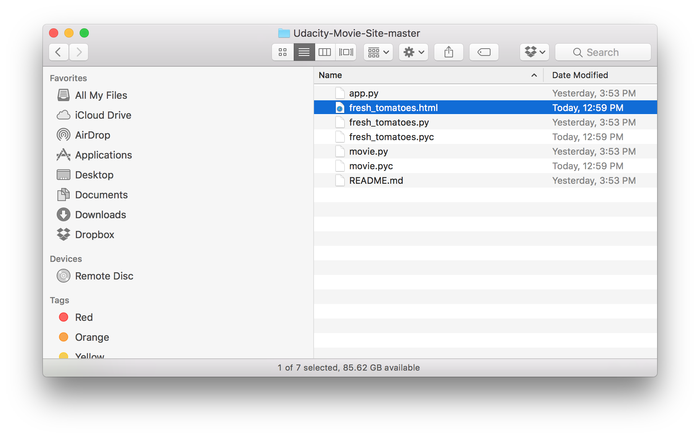

# Fresh Tomatoes

## Overview
The Fresh Tomatoes application presents a list of movies to a user, replete with poster art and links to the YouTube-hosted trailer for a given movie.



## Running the Application

To run the application, the project should first be downloaded to your machine from GitHub.



Once the project folder is on your computer, open a terminal window and navigate to the project directory. 

```
$ cd path/to/Udacity-Movie-Site-master
```

Assuming that Python is installed on your system, the application can be executed from the terminal using the following command:

```
$ python app.y
```

The application will generate a file named `fresh_tomatoes.html` in the project directory and open it in your web browser.

